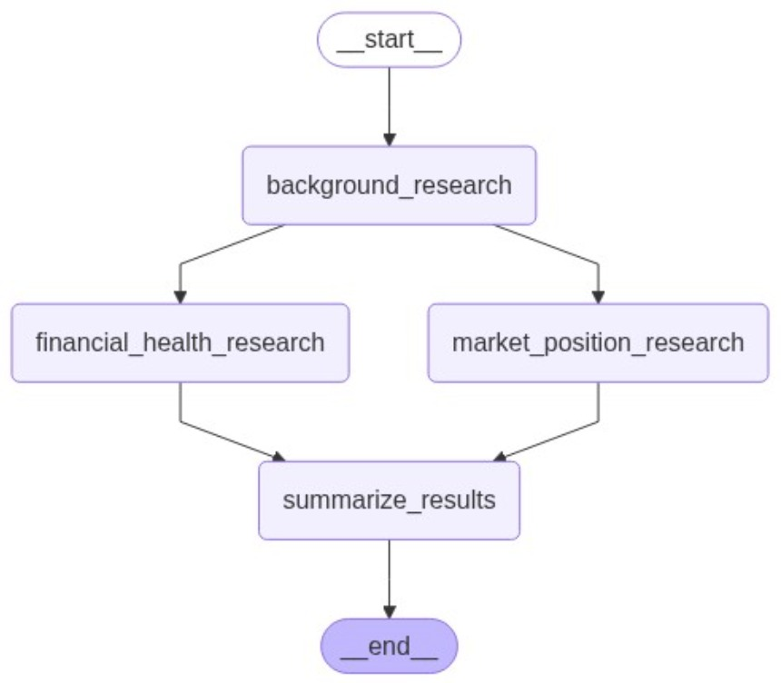
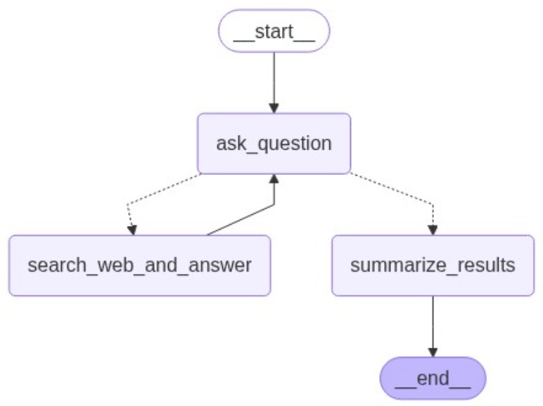

# Company Researcher 🔎

An AI-powered company research tool that provides comprehensive analysis of businesses using advanced LangGraph agents and web search capabilities. The application automatically gathers background information, analyzes financial health, evaluates market position, and identifies positive and negative aspects of any company.

## Project Overview

Company Researcher is an intelligent research assistant that automates the process of company analysis. Simply provide a company name and URL, and the system will:

- **Background Research**: Gather company history, industry information, founding details, mission/vision, milestones, and employee estimates
- **Financial Health Analysis**: Analyze revenue, expenses, profitability, and financial trends
- **Market Position Evaluation**: Assess competitors, market share, and industry positioning
- **Comprehensive Reporting**: Generate structured reports with positive and negative aspects

The application uses multiple specialized AI agents working in parallel to provide thorough, well-researched company insights.

## 🚀 Try It Live

**[Try the Company Researcher here →](http://company-research.eu-north-1.elasticbeanstalk.com/)**

Experience the full capabilities of our AI-powered company research tool with the live demo. Simply enter a company name and URL to get comprehensive analysis including background research, financial health evaluation, and market position assessment.

## Project Structure

```
company-researcher/
├── src/company_researcher/
│   ├── app/                                      # FastAPI application
│   │   ├── app.py                                # Main FastAPI app with routes
│   │   ├── schemas/                              # Pydantic models
│   │   └── templates/                            # Jinja2 HTML templates
│   ├── config/                                   # Configuration management
│   │   ├── config.py                             # Configuration schema & loader
│   │   └── config.yaml                           # Application settings
│   └── core/                                     # Core business logic
│       ├── agents/                               # LangGraph agents
│       ├── api_clients/                          # External API integrations
│       └── db/                                   # Database operations
├── application.py                                # WSGI entry point for deployment
├── Procfile                                      # Elastic Beanstalk process configuration
├── requirements.txt                              # Python dependencies
├── .env-example                                  # Environment variables template
├── README.md                                     # Main project documentation
├── docs/                                         # Images, diagrams, or extra markdown docs
├── .ebextensions/                                # EB environment config (e.g. env vars, packages)
├── .platform/                                    # EB platform hooks (e.g. NGINX's timeout setup)
```

## Architecture Summary

The system follows a multi-agent architecture powered by LangGraph:

### Agent Flow
1. **CompanyResearchAgent** - Acts as the main orchestrator: it coordinates all agents, collects their outputs, and compiles the final research report.
2. **BackgroundAgent** - Specializes in gathering fundamental company information
3. **Financial Health Agent** - Focuses on financial data and health indicators
4. **Market Position Agent** - Analyzes competitive landscape and market positioning
5. **Results Summarization** - Consolidates findings into structured output

### System Components
- **FastAPI Backend** - RESTful API serving research requests
- **LangGraph Orchestration** - Manages agent workflows and state transitions
- **Tavily API Integration** - Performs intelligent web searches
- **OpenAI LLM Processing** - Analyzes and synthesizes research data
- **MongoDB Logging** - Stores research results and maintains history
- **Web UI** - Simple, responsive interface for user interaction

### Data Flow
Input (Company Name + URL) → [Company Researcher] → MongoDB Logging → UI Display

#### CompanyResearcher:


#### Financial Researcher & Market Researcher



## Tech Stack

### Backend
- **FastAPI** - Modern Python web framework
- **LangGraph** - Agent workflow orchestration
- **OpenAI GPT** - Language model for analysis and synthesis
- **Pydantic** - Data validation and serialization

### Data & Search
- **Tavily API** - Intelligent web search and content extraction
- **MongoDB Atlas** - Cloud database for result logging
- **PyMongo** - MongoDB Python driver

### Frontend
- **HTML/CSS/JavaScript** - Lightweight, responsive web interface

### Deployment & Infrastructure
- **AWS Elastic Beanstalk** - Cloud application platform
- **Gunicorn + Uvicorn** - ASGI server stack

## Setup Instructions

### 1. Clone the Repository
```bash
git clone <repository-url>
cd company-researcher
```

### 2. Install Dependencies
```bash
pip install -r requirements.txt
```

### 3. Environment Configuration
Copy the example environment file and configure your API keys:

```bash
cp .env-example .env
```

Edit `.env` with your credentials:
```env
OPENAI_API_KEY=your_openai_api_key_here
TAVILY_API_KEY=your_tavily_api_key_here
MONGO_URI=your_mongodb_connection_string_here
```

### 4. Required API Keys

#### OpenAI API Key
- Sign up at [OpenAI Platform](https://platform.openai.com/)
- Create an API key in your dashboard
- Ensure you have sufficient credits for GPT model usage

#### Tavily API Key
- Register at [Tavily](https://tavily.com/)
- Obtain your API key from the dashboard

#### MongoDB Atlas Setup
- Create a free account at [MongoDB Atlas](https://www.mongodb.com/atlas)
- Create a new cluster
- Set up database user and network access
- Get your connection string in format:
```
mongodb+srv://<username>:<password>@<cluster>.mongodb.net/<database>?retryWrites=true&w=majority
```

### 5. Configuration
The application uses `src/company_researcher/config/config.yaml` for settings. Default configuration:
```yaml
openai_model: "gpt-4o"
llm_temperature: 0.0
max_searches_per_agent: 1
```

**Configuration Fields:**

- **`openai_model`**: Specifies which OpenAI language model to use for analysis and synthesis (e.g., "gpt-4o", "gpt-4")
- **`llm_temperature`**: Controls the randomness of AI responses (0.0 = deterministic/consistent, 1.0 = creative/varied)
- **`max_searches_per_agent`**: Limits the number of web searches each research agent can perform per analysis

## Run Locally

### Start the Application
```bash
cd src
uvicorn src.company_researcher.app.app:app --host 0.0.0.0 --port 8000 --reload
```

### Using the Web Interface
1. Navigate to http://localhost:8000
2. Enter the company name (e.g., "Tesla")
3. Enter the company URL (e.g., "https://www.tesla.com")
4. Click "Research" to start the analysis
5. Wait for the multi-stage research process to complete
6. Review the comprehensive report with background, financial health, market position, and key insights

## Deploy Instructions

### AWS Elastic Beanstalk Deployment

#### 1. Install EB CLI
```bash
pip install awsebcli
```

#### 2. Initialize Elastic Beanstalk
```bash
eb init
```
- Select your AWS region
- Choose Python platform
- Select the latest Python 3.x version

#### 3. Create Environment
```bash
eb create company-researcher-env
```

#### 4. Configure Environment Variables
Set your environment variables in the EB console or via CLI:
```bash
eb setenv PYTHONPATH=/var/app/current/src OPENAI_API_KEY=your_key TAVILY_API_KEY=your_key MONGO_URI=your_uri
```

#### 5. Deploy
```bash
eb deploy
```

### Deployment Files
The repository includes deployment configuration:
- **Procfile**: Gunicorn server configuration for Elastic Beanstalk
- **application.py**: WSGI entry point
- **requirements.txt**: Python dependencies

### MongoDB Atlas Configuration
1. Whitelist your Elastic Beanstalk IP ranges in MongoDB Atlas Network Access
2. Create a dedicated database user for the application
3. Use the connection string in your environment variables
